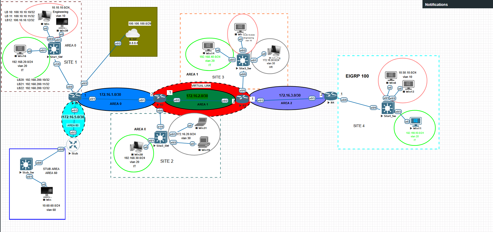
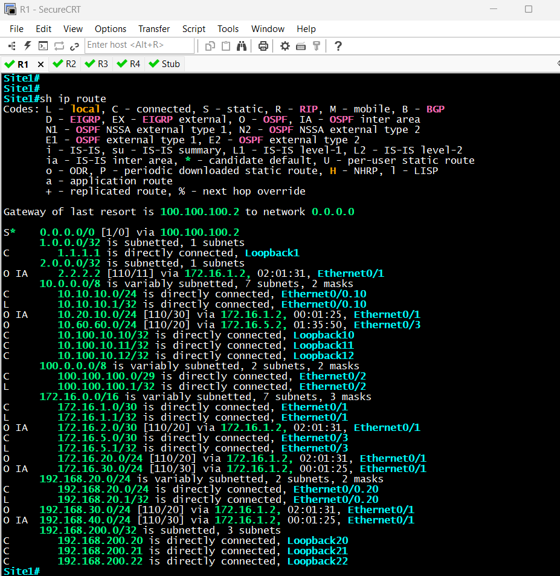
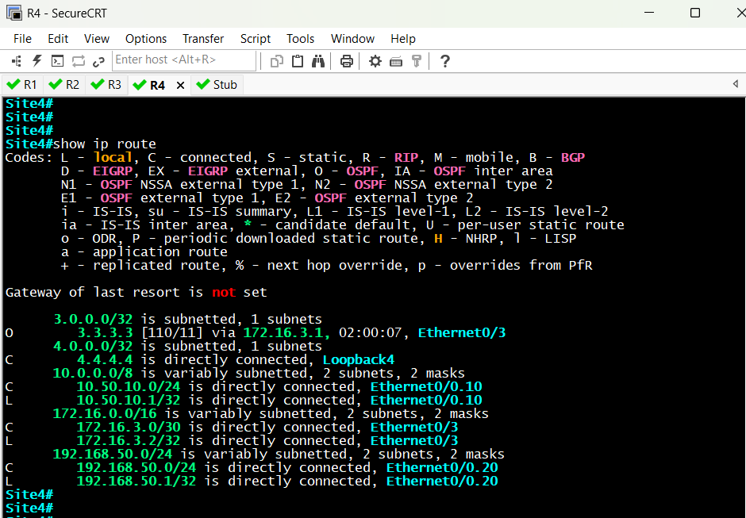
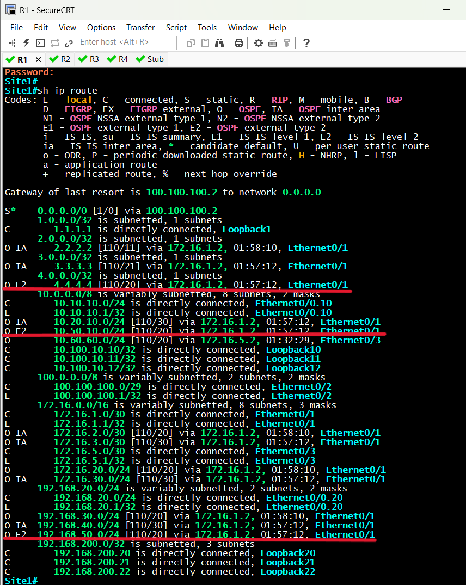
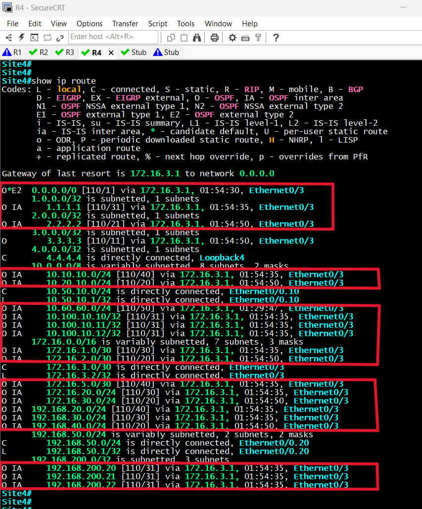
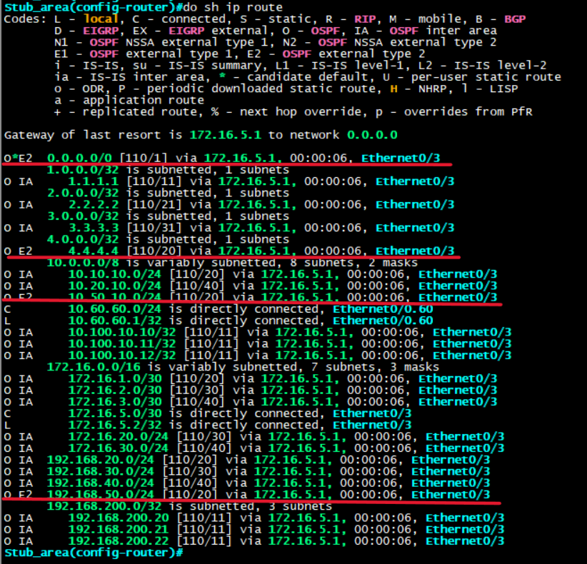
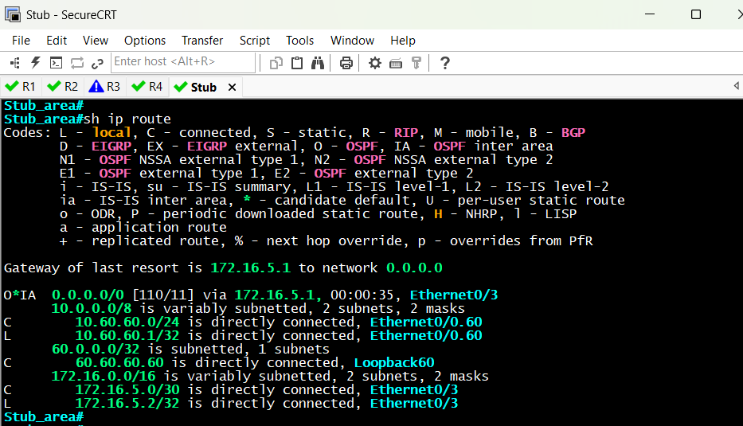
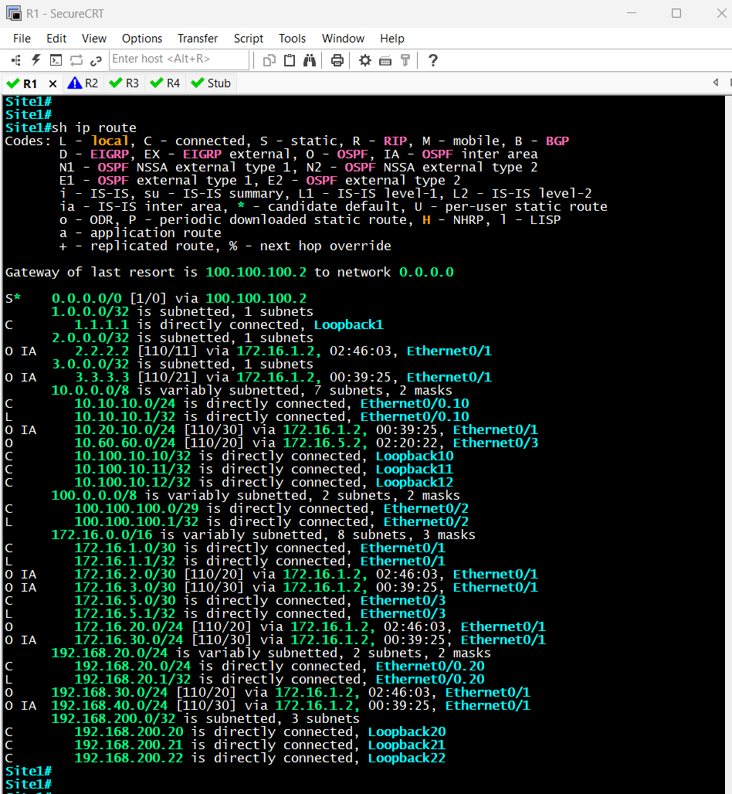
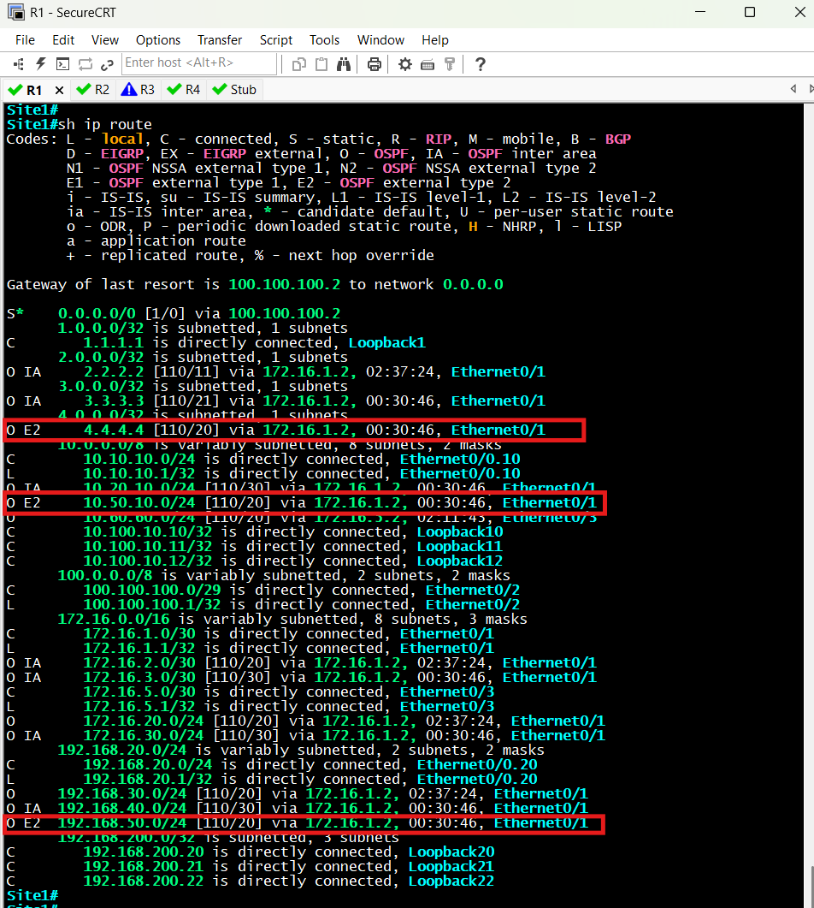
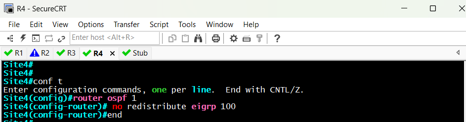

# OSPF Lab Documentation

This lab demonstrates OSPF multi-area design, virtual link recovery, stub areas, and redistribution between OSPF and EIGRP.  
All configurations were tested and verified with `show ip route` and connectivity checks.

---

## 1. Topology Overview


- Multi-area OSPF (Areas 0, 1, 2, 60)
- EIGRP domain connected via R4
- ISP cloud for external reachability
- Loopbacks simulate end-user subnets

---

### 2. Virtual Link

### Purpose
Area 2 was not directly connected to Area 0. A virtual link was configured through Area 1 to maintain backbone connectivity.

### Before
**R1**


**R4**


- OSPF adjacency between R2 and R3 not fully established
- Backbone reachability broken on R4

### After
**R1**


**R4**


- Virtual link established
- Backbone adjacency restored (FULL state)
- Routes from Area 1 successfully learned in Area 0

---

## 3. Stub Area (Area 60)

### Purpose
Reduce LSDB size in Area 60 by blocking external and inter-area routes, injecting only a default route.

### Before


- Area 60 received the full routing table, including external prefixes

### After


- Area 60 receives only a default route (`O*IA 0.0.0.0/0`)
- External routes filtered
- Smaller, optimized routing table

---

## 4. Redistribution (OSPF ↔ EIGRP)

### Purpose
Allow OSPF domain to reach networks in EIGRP, and vice versa, using R4 as the redistribution point.

### Before (Redistribution OFF)


- No external routes (`O E2`) in the OSPF domain
- OSPF-only routers could not reach EIGRP networks

### After (Redistribution ON)


- External routes appear as `O E2`
- OSPF domain can now reach EIGRP networks
- Verified with successful pings

### Action Reference


---

## 5. Verification Commands

Key commands used:
```bash
show ip route
show ip ospf neighbor
show ip ospf database
show ip protocol
show running-config | section ospf
show ip ospf interface
traceroute [destination]
ping [destination]

